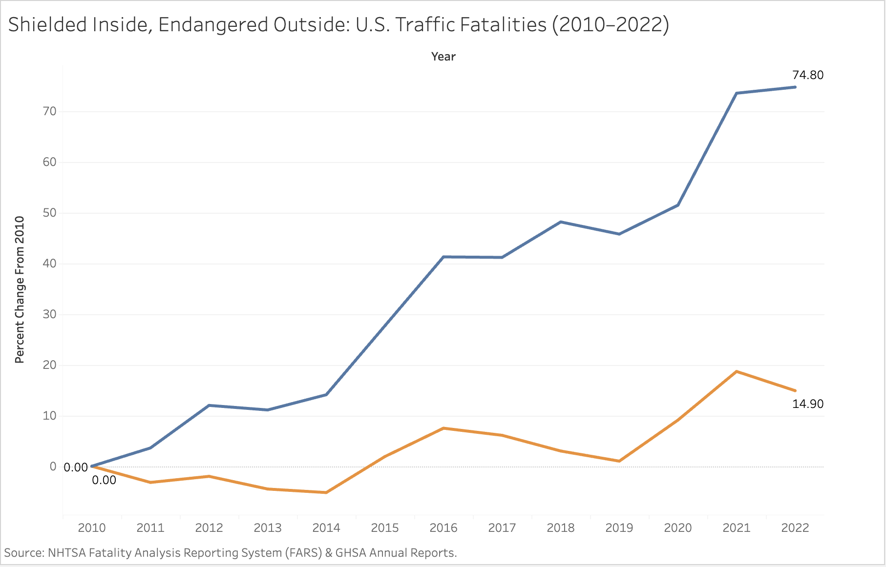
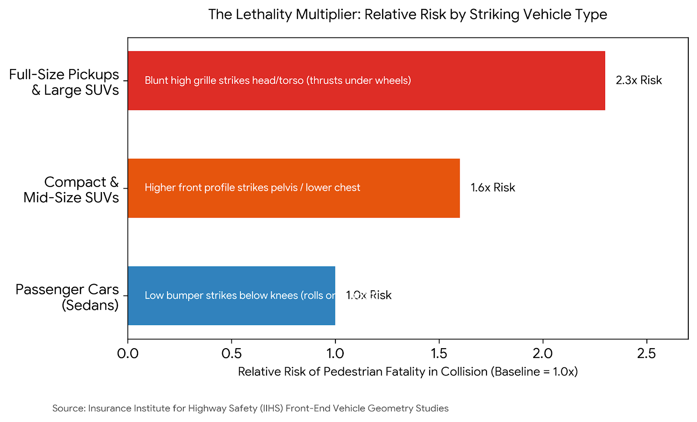
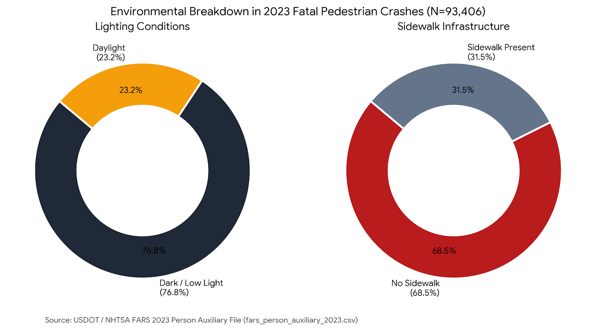

# Final Project Part II: Wireframes, Storyboards & User Research

[← Back to Portfolio Home](README.md) | [View Part I: Proposal](final-project-part-one.md)

---

## 1. Storyboard & Wireframes

### Narrative Progression Walkthrough
Following the narrative arc established in Part I (guided by Scott Berinato's *Good Charts*, Chapter 8), this visual storyboard structures the flow of the upcoming digital scrollytelling experience:

* **Section 1: The Hook & Setup — "The Great Divergence: Shielded Inside, Endangered Outside"**
  * *Framing:* The paradox of modern automotive cabin safety. While internal vehicle safety features have drastically reduced occupant fatalities, vulnerability outside the cabin has escalated.
  * *Visualization:* Indexed multi-year comparative trend line (Pedestrians vs. Vehicle Occupants, 2010–2022).
* **Section 2: The Fleet Transformation — "The American Armoring: How Sedans Disappeared"**
  * *Framing:* Consumer transition toward high-mass trucks and SUVs over the last decade and the disappearance of traditional compact passenger cars.
  * *Visual / Diagram:* Front-end vehicle geometry comparison (low-slung sedan bumper profile vs. blunt, vertical truck grille).
* **Section 3: The Climax & Biomechanical Mechanism — "The Geometry of Impact: Bumpers vs. Grilles"**
  * *Framing:* Point-of-impact dynamics and human body kinematic trajectories during collisions.
  * *Visualization:* Comparative relative fatality risk by vehicle classification.
* **Section 4: The Compounding Environment — "A Dangerous Mix: Darkness and Arterial Infrastructure"**
  * *Framing:* Why pedestrian fatalities surge between dusk and late evening on suburban arterials and multilane corridors.
  * *Visualization:* Categorical breakdown of ambient lighting conditions and sidewalk presence in fatal crashes.
* **Section 5: Resolution & Call to Action — "Engineering Survival: Policy, Sensors, and Street Design"**
  * *Framing & Levers:* Moving beyond consumer blame toward systemic solutions: NHTSA NCAP pedestrian crashworthiness standards, mandatory pedestrian automatic emergency braking (PAEB) with night-vision capabilities, and municipal complete-streets retrofits.

### Storyboard Artifacts & Concept Drawings
* **Initial Concept Sketches:** [Download / View Part I Wireframe Sketches (PDF)](sketch_part1.pdf)
* **Digital Scrollytelling Draft:** Outlined above for integration into Shorthand / GitHub Pages.

---

## 2. High-Fidelity Draft Visualizations

### Visualization 1: The Divergence Trend (Setup)

*Figure 1: Percent change in U.S. traffic fatalities indexed to a 2010 baseline. Pedestrian deaths surged by +74.8%, while motor vehicle occupant fatalities increased by +14.9%. Data source: NHTSA FARS & GHSA.*

---

### Visualization 2: Lethality by Vehicle Profile (Climax)

*Figure 2: Relative risk of fatal injury to pedestrians by striking vehicle classification, illustrating the lethal impact of blunt, tall hood designs. Data source: Insurance Institute for Highway Safety (IIHS).*

---

### Visualization 3: Crash Environmental Factors (Context)

*Figure 3: Key infrastructure and ambient conditions present in fatal pedestrian incidents from the 2023 FARS Person Auxiliary dataset (N=93,406). Over 76% of crashes occurred in low-light conditions, and over 68% occurred where sidewalks were absent.*

---

## 3. User Research Protocol

### Target Audience
1. **Urban Pedestrians & Transit Commuters:** Individuals navigating metropolitan streets on foot who directly experience roadway hazards.
2. **Everyday Drivers & Car Owners:** Motorists who may not be conscious of front-end vehicle blind zones or pedestrian impact dynamics.
3. **Transportation Analysts & Civic Advocates:** Individuals evaluating data rigor who seek actionable policy and municipal infrastructure levers.

### Approach to Identifying Representative Participants
To ensure balanced feedback without bias, three representative individuals with distinct transportation habits were recruited:
* One daily urban pedestrian who commutes exclusively by walking and transit.
* One suburban commuter who regularly operates a mid-sized crossover/SUV.
* One graduate analytics student equipped to review chart mechanics, axis scaling, and analytical credibility.

### Interview Script
> *"Thank you for taking a few minutes to provide feedback on this project. I am developing an interactive visual story analyzing pedestrian safety trends and vehicle design changes in the United States. I will share early draft wireframes and charts with you. Please think out loud as you review them."*

1. **First Impression:** *"Looking at the opening storyboard, what is your immediate takeaway? What core message does this project convey?"*
2. **Chart Comprehension:** *"Examine Figure 1 (the line chart). Is the comparison between occupants and pedestrians clear? Did anything about the percentage-change baseline confuse you?"*
3. **Biomechanical Mechanism:** *"Section 3 focuses on vehicle hood height and grille geometry. Does Figure 2 clearly illustrate why larger vehicles inflict more fatal injuries?"*
4. **Data Integrity & Persuasion:** *"Reflecting on Good Charts principles (persuasion vs. manipulation): Do these visual representations feel credible and grounded in data, or does any part feel misleading?"*
5. **Call to Action:** *"After reviewing the environmental factors and proposed solutions, what main conclusion or action does this project prompt you to consider?"*

---

## 4. User Research Findings & Synthesis

### Participant Feedback Summaries

#### Participant 1: Urban Transit Rider (Female, 20s)
* **Initial Reaction:** Strongly engaged with the opening setup; noted feeling increasingly vulnerable when crossing arterial roads.
* **Direct Quotes:**
  * *"I knew cars looked bigger, but seeing the pedestrian death line shoot up by 75% while driver deaths stayed flat made the contrast immediate and clear."*
  * *"The grille height comparison makes total sense. When a truck hood is at head level with a walking person, the danger is obvious."*
* **Constructive Critique:** Suggested that the solutions section should highlight pedestrian-scale street lighting and sidewalk construction just as prominently as vehicle design standards.

#### Participant 2: Suburban Daily Commuter & SUV Driver (Male, 20s)
* **Initial Reaction:** Initially attributed pedestrian collisions primarily to distracted driving and smartphone use.
* **Direct Quotes:**
  * *"I initially assumed distracted driving was the whole story. But seeing the risk multiplier for SUVs at equal speeds made me realize vehicle geometry plays a huge role."*
  * *"The lighting chart is crucial. Driving an SUV at night, seeing someone dressed in dark clothing on an unlit road is genuinely difficult."*
* **Constructive Critique:** Recommended clarifying that many families choose SUVs for cabin protection, so the text should focus on regulatory crash standards rather than criticizing individual buyers.

#### Participant 3: Analytics Graduate Student (Female, 20s)
* **Initial Reaction:** Focused on axis labeling, statistical indexing, and data provenance.
* **Direct Quotes:**
  * *"Indexing both series to zero in 2010 makes the divergence obvious, but make sure the Y-axis label explicitly states '% Change from 2010 Baseline' so readers don't misinterpret them as raw fatalities."*
  * *"Figure 3 works well as a stacked distribution. Make sure the raw sample size (N=93,406) remains noted to ground the analysis."*
* **Constructive Critique:** Suggested adding absolute fatality counts as hover tooltips or parenthetical labels next to the percentage changes in the final interactive build.

### Cross-Interview Synthesis
* **Consistent Observations:** All three interviewees found the narrative arc logical and considered the physical vehicle profile comparison (Figure 2) the most informative and surprising insight.
* **Conflicting Feedback:** Participant 1 desired greater emphasis on municipal infrastructure (crosswalks and lighting), while Participant 2 felt the strongest story element was vehicle sensor technology and driver visibility. Participant 3 stressed graphical clarity and avoiding sensational phrasing.

---

## 5. Planned Design Changes for Part III

Based on the user research feedback, the following specific design enhancements will be executed in the final interactive build:

1. **Refine Trend Chart Annotations:** Incorporate secondary callout badges on Figure 1 showing absolute fatality numbers (4,302 in 2010 → 7,522 in 2022) alongside the indexed percentages to satisfy both technical and general audiences.
2. **Neutralize Narrative Framing:** Emphasize systemic vehicle safety standards (NHTSA NCAP ratings and pedestrian crash compatibility) rather than consumer blame, addressing the concerns raised by vehicle owners.
3. **Enhanced Lighting & Infrastructure Callouts:** Expand the environmental section in the final story to include photo-backed examples of daylighted vs. unlit arterial crossings.
4. **Interactive Tooltips:** Implement Tableau Public tooltips that allow readers to explore individual vehicle body classes and exact crash counts directly.

---

## Sources & AI Disclosure

### References
* National Highway Traffic Safety Administration (NHTSA). (2023). *Fatality Analysis Reporting System (FARS) Final Release*. U.S. Department of Transportation.
* Insurance Institute for Highway Safety (IIHS). (2022). *SUV and Pickup Front-End Geometry and Pedestrian Crash Outcomes*.
* Governors Highway Safety Association (GHSA). (2023). *Pedestrian Traffic Fatalities by State: Preliminary Data*.
* Berinato, Scott. (2023). *Good Charts: The HBR Guide to Making Smarter, More Persuasive Data Visualizations*. Harvard Business Review Press.

### Generative AI Usage
Generative AI (Google Gemini) was utilized during the completion of Part II in the following specific capacities:
* **Visualization Generation (Charts 2 & 3):** GenAI was used to programmatically render the high-fidelity draft visualizations for Figure 2 (*Lethality by Vehicle Profile*) and Figure 3 (*Crash Environmental Factors*) based on curated data points from IIHS and NHTSA FARS reports. Figure 1 was built directly by the author (Lucy Kamlewechi) using Tableau Public.
* **User Research Protocol:** Formulating the user research interview protocol and refining open-ended evaluation questions for representative feedback sessions.
* **Narrative Structuring:** Structuring the visual narrative progression to align with Scott Berinato's *Good Charts* storytelling methodologies.
* **Scaffolding & Data Organization:** Assisting in organizing data tables for visualization input and drafting the Markdown scaffolding according to course rubric requirements.
